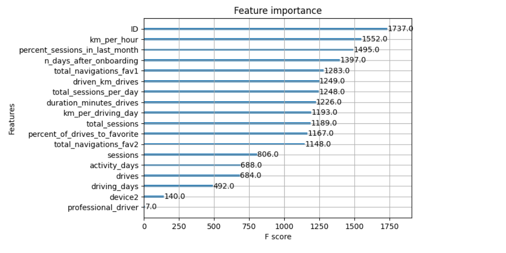
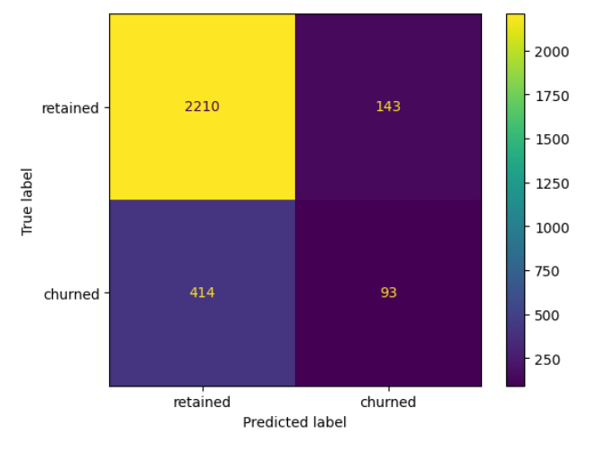
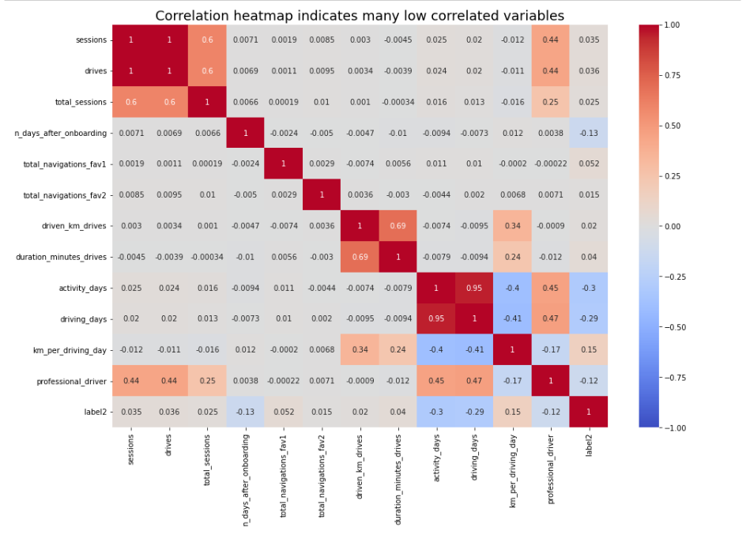

# Waze Churn Prediction (Machine Learning Project)

# Project Overview

This project focuses on predicting user churn using machine learning techniques. The goal is to identify users likely to stop using the platform and provide insights to improve user retention.

# Business Objective

The objective of this project is to help stakeholders at Waze identify high-risk users and take proactive measures to reduce churn and improve customer retention.

# Dataset

* Source: Waze dataset (Google Advanced Data Analytics Certificate)
* Description: Contains user activity, engagement metrics, and behavioral data

## Modeling Approach

This project includes multiple modeling approaches:
1) Regression modeling: Logistic regression
2) Random forest model

# Key Insights from Analysis and Hypothesis Testing

1) It was observed that drivers who use an iPhone device to interact with the application have a higher number of drives on average. However, this difference might arise from random sampling, rather than being a true difference in the number of drives. So, to assess whether the difference is statistically significant, I used a a two-sameple t-test.

2) Through the results of the t-test we could conclude that there is not a statistically significant difference in the average number of drives between drivers who use iPhones and drivers who use Androids.

# Key Insights from Regression Analysis

1) Variable called "activity_days" was by far the most important feature in the model. It had a negative correlation with user churn.

2) The correlation heatmap here revealed the variable "km_per_driving_day" to have the strongest positive correlation with churn of any of the predictor variables by a relatively large margin.

# Machine Learning Model

* Model Used: Random Forest (Cross validation)
* Techniques: Feature Engineering, Model Training, Evaluation
* Performance: precision->0.457163; recall->0.126782;	F1->0.198445;	accuracy->0.81851

# Model insights

# Confusion Matrix

# Correlation heatmap

# Business Recommendations

1) I would not recommend this model to be used to drive consequential business decisions. The model is not a strong enough predictor, as made clear by its poor recall score. However, if the model is only being used to guide further exploratory efforts, then it can have value.

2) New features could be engineered to try to generate better predictive signal, as they often do if you have domain knowledge. In the case of this model, the engineered features made up over half of the top 10 most-predictive features used by the model. It could also be helpful to reconstruct the model with different combinations of predictor variables to reduce noise from unpredictive features.

3) It would be helpful to have drive-level information for each user (such as drive times, geographic locations, etc.). It would probably also be helpful to have more granular data to know how users interact with the app. For example, how often do they report or confirm road hazard alerts? Finally, it could be helpful to know the monthly count of unique starting and ending locations each driver inputs.

# Project Files

* Notebook: [📓Notebook](notebooks/waze_churn_prediction_model.ipynb)

* For detailed exploratory analysis and statistical testing:
👉 [EDA & Statistical Analysis Project](https://github.com/shree872/waze_churn_eda_and_statistical_analysis)

* [📓 Regression Model](notebooks/waze_churn_regression_model.ipynb)

* Executive Summary: [📄 Executive Summary](executive_summary.pdf)

# Tools & Technologies

Python, Pandas, NumPy, Matplotlib, Scikit-learn

